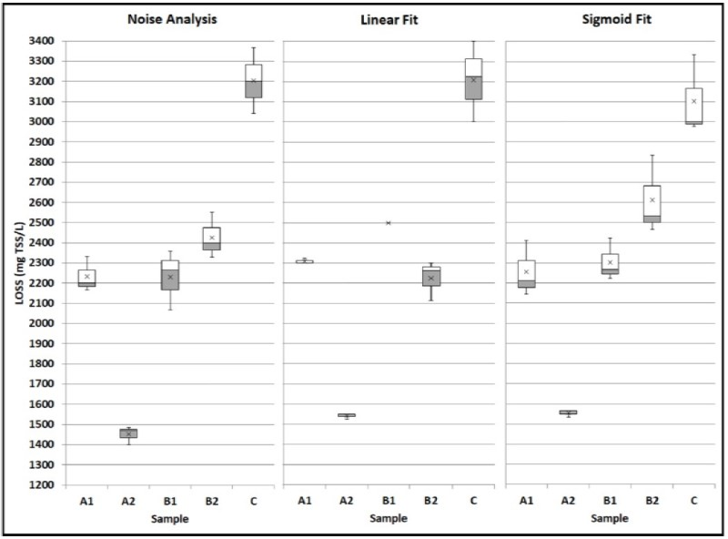
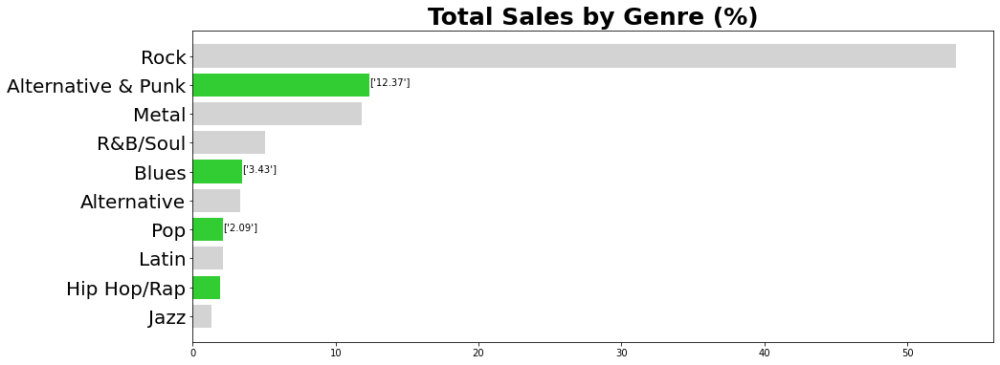
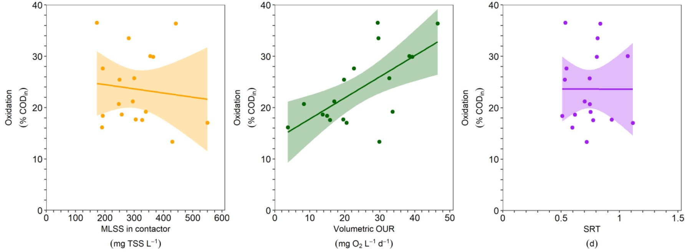
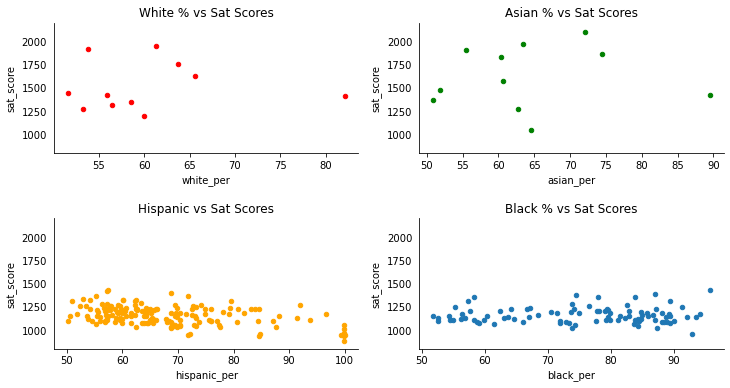
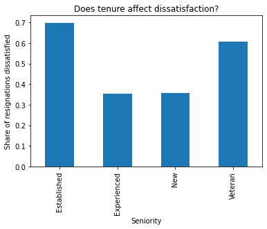
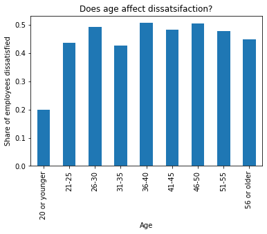
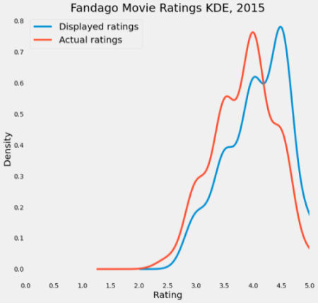
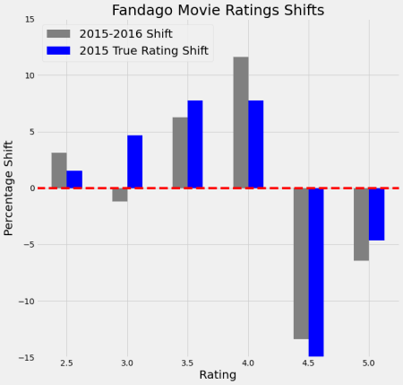

## [Calculating the Limit of Stokesian Settling in Wastewater](https://github.com/OlaOlagunju/LOSS_Project)
-	Built a new system for quantifying the minimum concentration of wastewater at which sedimentation in settling tanks cause poor water quality. Also known as Limit of Stokesian Settling (LOSS) 
- Designed a unique R algorithm to convert 100’s of images of settling wastewater (in 2-liter jars) to color indexes in order to analyze light penetration through the jar
- Implemented 3 mathematical models in R to process color indexes based on regression analysis, sigmoid fitting and mean deviation of light through the jar

 

## [Data Analysis using SQL to guide Business decisions for Chinook](https://github.com/OlaOlagunju/SQL_Business_Project)
- Traversed a SQLite database and collected data to find out: top music genres sold in USA, music sales performance by country, employees sales performance, album vs individual track sales and popularity of tracks in the store
- Proposed that bringing in Rock bands should be the next business venture as they garnered over 50% of tracks sold
- Advocated to expand marketing efforts in India, due to the large population (over 1.3 billion) and one of the highest customer average lifetime purchases ($91.58)

 

## [Using the Oxygen Uptake Rate of Biomass as a Control Parameter in Wastewater Treatment](https://github.com/OlaOlagunju/OUR_Project)
- Built automated system to continuously (1 hr. cycles) analyze microbial activity in wastewater via Oxygen Uptake Rate (OUR) respirometry and operate PLC’s for pump and sensor I/O
- Implemented C++ algorithms to control microbial wasting, water, aeration, Proportional, Integral and Derivative (PID) tuning, based on a target OUR range.
- Developed R algorithms code to analyze the hourly data
- Led daily laboratory research experiments to assess wastewater quality from the pilot and the plant’s mainstream channels
- Championed a novel way to increase energy recovery in secondary wastewater treatment by 36% while targeting a specific microbial activity under variable influent and temperature conditions in a year

  

## [Analyzing NYC High School SAT Scores](https://github.com/OlaOlagunju/SAT_Scores_Project)
- Exploratory Data Analysis (EDA) of SAT Scores from 363 High schools in 32 Districts. Included alternative High schools in New York City and established association with socio-economic factors in each district
- Ascertained that African-American and Hispanic students were statistically (16%) more likely to perform worse in SAT exams, due to their residence in low income districts
- Discovered that schools in more suburban areas (Staten Island & Queens) were likely to perform better in SAT exams than those in the city. Likewise schools with larger class sizes (public schools) perform better than schools with small class sizes

 

## [Analyzing Employee Exit Surveys](https://github.com/OlaOlagunju/Employee_Survey_Project)
- Dissected exit surveys from about 1000 employees of the Department of Education, Training and Employment (DETE) and the Technical and Further Education (TAFE) institute in Queensland, Australia
- Deduced that employees with tenures longer than 6 years were 50% more likely to resign due to job dissatisfaction than those employees with less than 6 years of experience. In addition, age is not statistically significant to job dissatisfaction (p > 0.05)

 

 

## [Analyzing the Inflation of Fandango Ratings from 2015-2017](https://github.com/OlaOlagunju/Fandango_Ratings_Project)
- Inspected over 300 Fandango movie ratings from 2015-2017, to assess accusations of Fandango unduly increasing the actual ratings
- Determined that the ratings were not statistically different (p > 0.05) even though Fandango changed their rating algorithm between 2015 and 2017

 

 

## [Analyzing the Popularity of Hacker News Posts](https://github.com/OlaOlagunju/Hacker_News_Project)
- Investigated over 300,000 posts on the Hcker News site, examining the popularity of different categories of posts and best times for users to make posts i.e. when the community engagement is at its peak
- Proposed that user engagement would increase if more posts were made between 8-9pm EST or GMT

